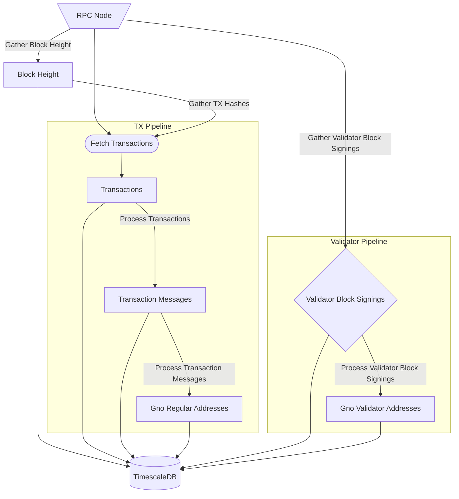
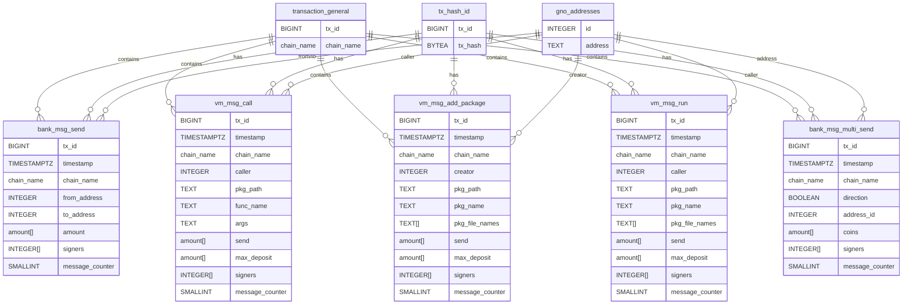
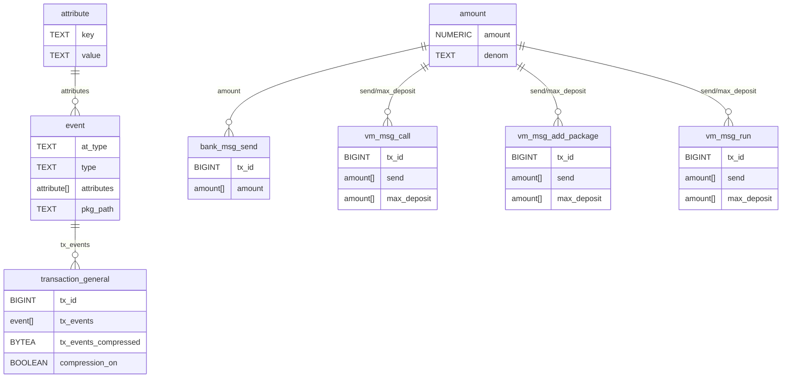
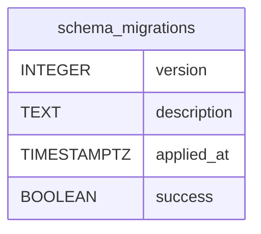
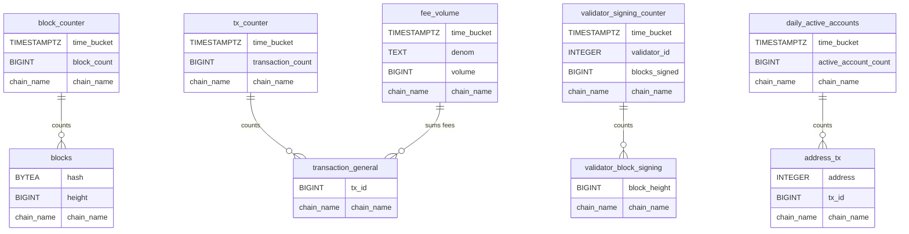

# Database Data Model and Schema

This file will outline how the data is gathered, stored and processed by the indexer.

## Data Flow from the RPC Node

The indexer will connect to the RPC node and will start to gather the data from the node.
It collects and processes data by using batch processing. For live mode the indexer will collect the data up to the
latest block height and then it will process it in batches.

The data is gathered in the following way:

First the indexer gathers block data and validator signing for those blocks. If there are transactions the
tx hashes are gathered from the block height data and are queried from the RPC. At that moment the transaction
data is gathered and processes and all the transaction general data and messages contained in the transaction
are stored in the database. The regular and validator addresses are processed in that way that the addresses are
stored as unique int32 ids and then referenced by the integer value in the transaction tables.

## Core Schema

```mermaid
erDiagram
    blocks {
      BYTEA hash
      BIGINT height
      TIMESTAMPTZ timestamp
      TEXT chain_id
      chain_name chain_name
    }
    tx_hash_id {
      BIGINT tx_id
      BYTEA tx_hash
      TIMESTAMPTZ timestamp
      chain_name chain_name
    }
    transaction_general {
      BIGINT tx_id
      chain_name chain_name
      TIMESTAMPTZ timestamp
      BIGINT block_height
      TEXT[] msg_types
      event[] tx_events
      BYTEA tx_events_compressed
      BOOLEAN compression_on
      BIGINT gas_used
      BIGINT gas_wanted
      NUMERIC fee_amount
      TEXT fee_denom
      BOOLEAN success
      TEXT error_log
    }
    gno_addresses {
      INTEGER id
      TEXT address
      chain_name chain_name
    }
    gno_validators {
      INTEGER id
      TEXT address
      chain_name chain_name
    }
    validator_block_signing {
      BIGINT block_height
      TIMESTAMPTZ timestamp
      INTEGER proposer
      INTEGER[] signed_vals
      chain_name chain_name
    }
    address_tx {
      INTEGER address
      BIGINT tx_id
      chain_name chain_name
      TIMESTAMPTZ timestamp
    }
    blocks ||--o{ transaction_general : "contains"
    blocks ||--o{ validator_block_signing : "has"
    gno_validators ||--o{ validator_block_signing : "signs"
    gno_validators ||--o{ blocks : "proposes"
    tx_hash_id ||--o{ transaction_general : "identifies"
    transaction_general ||--o{ address_tx : "involves"
    gno_addresses ||--o{ address_tx : "participates"
```

## Message Types

## Custom Types

## Schema versioning

`schema_migrations` is a global table (no `chain_name`) that records which migrations have been applied to
the database. Because schema changes affect all chains at once, versioning is per-database, not per-chain.

The `version` column is the primary key and should be incremented sequentially for each migration. 
`applied_at` defaults to `NOW()` so it is set automatically on insert. `success` lets you record a failed 
migration attempt without deleting the row. Since the project is still in development it won't probably be
used until a stable version of indexer is published.

## Aggregates

